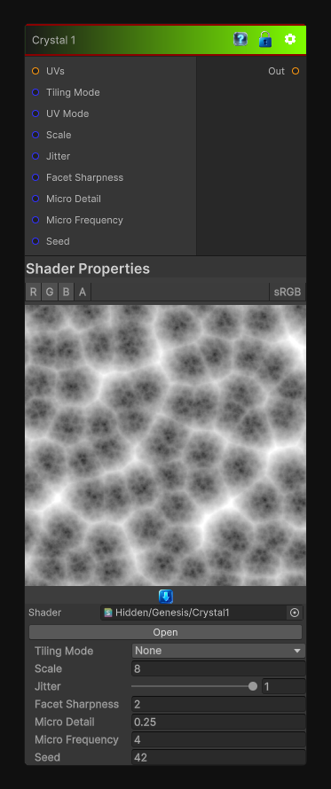

# Crystal 1

> This file is auto-generated by `Documentation/Generate-GenesisNodeDocs.ps1`.

[Back to index](../../README.md) | [Back to Generators](../../generators.md)

## Snapshot

## Details

- Menu: `Generators/Pattern/Crystal 1`
- Node group: `Pattern`
- Shader: `Hidden/Genesis/Crystal1`
- Source: [Runtime/Nodes/Generator/Pattern/Crystal1Node.cs](../../../../Runtime/Nodes/Generator/Pattern/Crystal1Node.cs)

## Documentation

Produces:
- Crystal facets
- Mineral breakup
- Angular cell edges
- Hard or soft crystalline patterns
- Perfect for stone, ice, minerals, stylized surfaces
