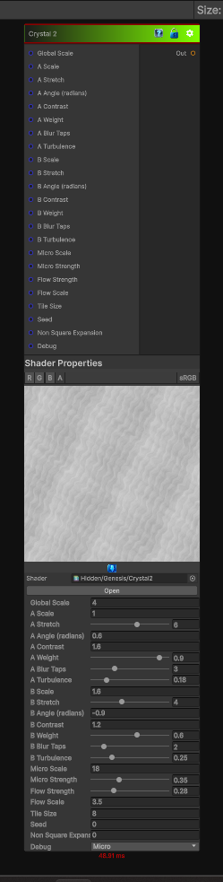

# Crystal 2

> This file is auto-generated by `Documentation/Generate-GenesisNodeDocs.ps1`.

[Back to index](../../README.md) | [Back to Generators](../../generators.md)

## Snapshot

## Details

- Menu: `Generators/Pattern/Crystal 2`
- Node group: `Pattern`
- Shader: `Hidden/Genesis/Crystal2`
- Source: [Runtime/Nodes/Generator/Pattern/Crystal2Node.cs](../../../../Runtime/Nodes/Generator/Pattern/Crystal2Node.cs)

## Documentation

- Worley F1, F2, F3
- A facet intensity function based on
(F3-F1)
- Much sharper, more geometric edges
= Stronger contrast between facets
- More mineral-like angularity
- Optional ridge shaping
