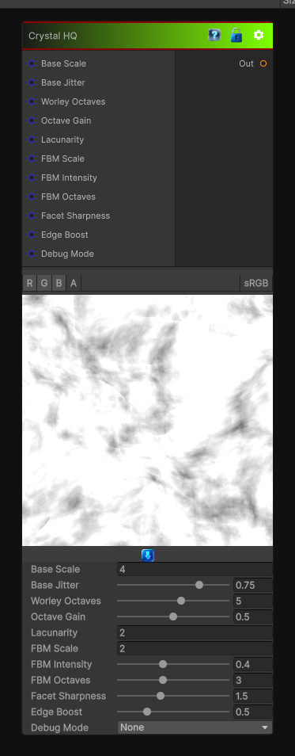

# Crystal HQ

> This file is auto-generated by `Documentation/Generate-GenesisNodeDocs.ps1`.

[Back to index](../../README.md) | [Back to Generators](../../generators.md)

## Snapshot

## Details

- Menu: `Generators/Pattern/Crystal HQ`
- Node group: `Pattern`
- Shader: `Hidden/Genesis/CrystalHQ`
- Source: [Runtime/Nodes/Generator/Pattern/CrystalHQNode.cs](../../../Doxygen/html/_crystal_h_q_node_8cs_source.html)

## Documentation

This is the Crystal HQ node you'll use for:
- Ice
- Minerals
- Rock
- Stylized crystals
- Gemstone breakup
- Terrain
- Organic crystalline structures
- High-frequency detail masks
