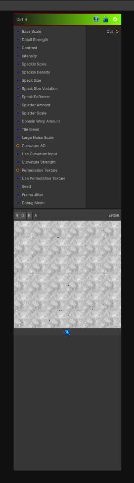

# Dirt 4

> This file is auto-generated by `Documentation/Generate-GenesisNodeDocs.ps1`.

[Back to index](../../README.md) | [Back to Generators](../../generators.md)

## Snapshot

## Details

- Menu: `Generators/Pattern/Dirt 4`
- Node group: `Pattern`
- Shader: `Hidden/Genesis/GrungeDirt4`
- Source: [Runtime/Nodes/Generator/Pattern/Dirt4Node.cs](../../../Doxygen/html/_dirt4_node_8cs_source.html)

## Documentation

Generates a fourth dirt-style grunge variant for adding irregular debris and breakup.
