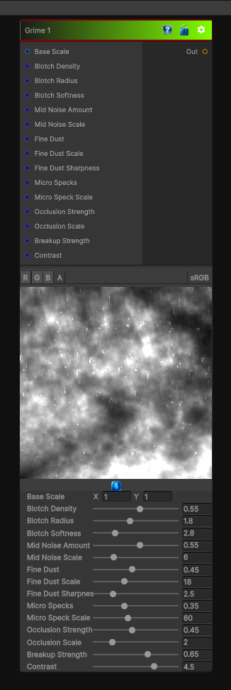

# Grime 1

> This file is auto-generated by `Documentation/Generate-GenesisNodeDocs.ps1`.

[Back to index](../../README.md) | [Back to Generators](../../generators.md)

## Snapshot

## Details

- Menu: `Generators/Pattern/Grime 1`
- Node group: `Pattern`
- Shader: `Hidden/Genesis/Grunge001`
- Source: [Runtime/Nodes/Generator/Pattern/GrimeNode.cs](../../../Doxygen/html/_grime_node_8cs_source.html)

## Documentation

Generates a grime pattern variant for aging surfaces, building dirt accumulation, and breaking up masks.
