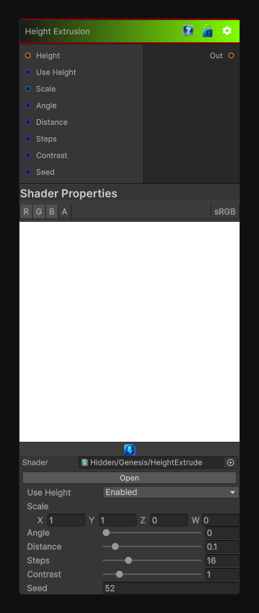

# Height Extrusion

> This file is auto-generated by `Documentation/Generate-GenesisNodeDocs.ps1`.

[Back to index](../../README.md) | [Back to Generators](../../generators.md)

## Snapshot

## Details

- Menu: `Generators/Pattern/Height Extrusion`
- Node group: `Pattern`
- Shader: `Hidden/Genesis/HeightExtrude`
- Source: [Runtime/Nodes/Generator/Pattern/HeightExtrudeNode.cs](../../../../Runtime/Nodes/Generator/Pattern/HeightExtrudeNode.cs)

## Documentation

Height Extrusion is the backbone of:
- bevel-like height shaping
- directional emboss
- silhouette expansion
- stylized height growth
- mask inflation
- directional erosion/inset (with invert)
