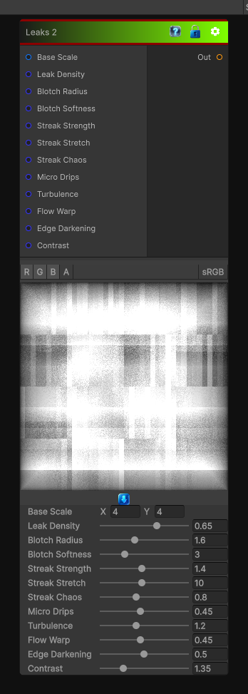

# Leaks 2

> This file is auto-generated by `Documentation/Generate-GenesisNodeDocs.ps1`.

[Back to index](../../README.md) | [Back to Generators](../../generators.md)

## Snapshot

## Details

- Menu: `Generators/Pattern/Leaks 2`
- Node group: `Pattern`
- Shader: `Hidden/Genesis/GrungeLeaks2`
- Source: [Runtime/Nodes/Generator/Pattern/LeaksNode2.cs](../../../Doxygen/html/_leaks_node2_8cs_source.html)

## Documentation

- Heavier leak origins (bigger blotches)
- Chaotic streak breakup
- Directional tearing
- Micro-drips
- Turbulent flow
- More contrast and edge variation
