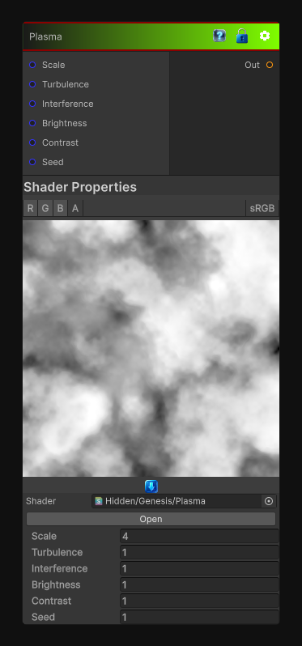

# Plasma

> This file is auto-generated by `Documentation/Generate-GenesisNodeDocs.ps1`.

[Back to index](../../README.md) | [Back to Generators](../../generators.md)

## Snapshot

## Details

- Menu: `Generators/Pattern/Plasma`
- Node group: `Pattern`
- Shader: `Hidden/Genesis/Plasma`
- Source: [Runtime/Nodes/Generator/Pattern/PlasmaNode.cs](../../../../Runtime/Nodes/Generator/Pattern/PlasmaNode.cs)

## Documentation

It's not just "FBM" and not just "noise turbulence"-it's a fractal interference pattern built from:
- Two or more layered noise fields
- Different frequencies
- Phase offsets
- Additive + subtractive interference
- Optional color remapping
- Soft, electric, cloudy, nebula-like structures
