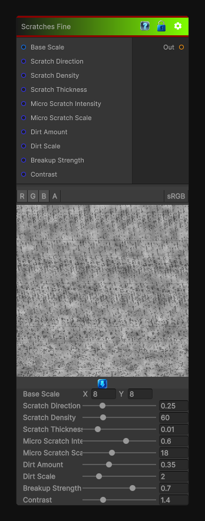

# Scratches Fine

> This file is auto-generated by `Documentation/Generate-GenesisNodeDocs.ps1`.

[Back to index](../../README.md) | [Back to Generators](../../generators.md)

## Snapshot

## Details

- Menu: `Generators/Pattern/Scratches Fine`
- Node group: `Pattern`
- Shader: `Hidden/Genesis/GrungeScratchesFine`
- Source: [Runtime/Nodes/Generator/Pattern/ScratchesFineNode.cs](../../../Doxygen/html/_scratches_fine_node_8cs_source.html)

## Documentation

- Deterministic hash-based noise
- Fine, dense, hairline scratches
- Micro-directional breakup
- Soft dirt accumulation for depth
- Adjustable contrast and breakup
