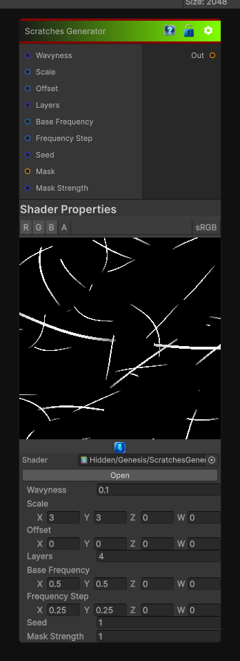

# Scratches Generator

> This file is auto-generated by `Documentation/Generate-GenesisNodeDocs.ps1`.

[Back to index](../../README.md) | [Back to Generators](../../generators.md)

## Snapshot

## Details

- Menu: `Generators/Pattern/Scratches Generator`
- Node group: `Pattern`
- Shader: `Hidden/Genesis/ScratchesGenerator`
- Source: [Runtime/Nodes/Generator/Pattern/ScratchesGeneratorNode.cs](../../../../Runtime/Nodes/Generator/Pattern/ScratchesGeneratorNode.cs)

## Documentation

This is not a texture lookup.
This is a true procedural scratch synthesizer:

Directional or chaotic
Adjustable density
Length, thickness, jitter
Breakup noise
Randomization seed
CRT-safe (2D / 3D / Cube)
Deterministic, atomic-free
