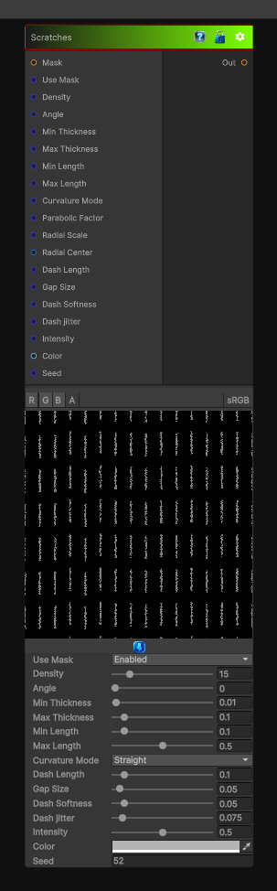

# Scratches

> This file is auto-generated by `Documentation/Generate-GenesisNodeDocs.ps1`.

[Back to index](../../README.md) | [Back to Generators](../../generators.md)

## Snapshot

## Details

- Menu: `Generators/Pattern/Scratches`
- Node group: `Pattern`
- Shader: `Hidden/Genesis/Scratches`
- Source: [Runtime/Nodes/Generator/Pattern/ScratchesNode.cs](../../../Doxygen/html/_scratches_node_8cs_source.html)

## Documentation

Generates scratch marks for worn, damaged, or weathered surface details.
