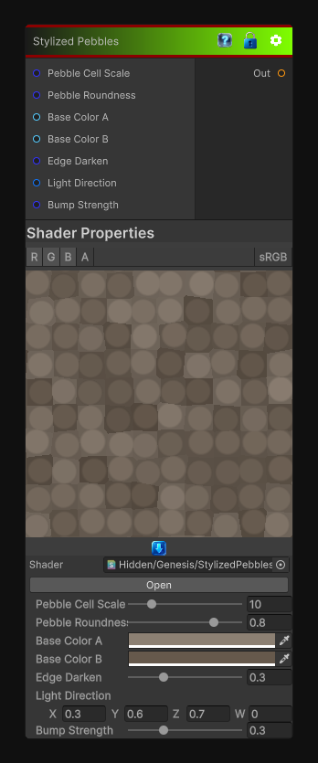

# Stylized Pebbles

> This file is auto-generated by `Documentation/Generate-GenesisNodeDocs.ps1`.

[Back to index](../../README.md) | [Back to Generators](../../generators.md)

## Snapshot

## Details

- Menu: `Generators/Pattern/Stylized Pebbles`
- Node group: `Pattern`
- Shader: `Hidden/Genesis/StylizedPebbles`
- Source: [Runtime/Nodes/Generator/Pattern/StylizedPebblesNode.cs](../../../../Runtime/Nodes/Generator/Pattern/StylizedPebblesNode.cs)

## Documentation

Generates a stylized pebble pattern suitable for ground textures, masks, and decorative surfaces.
