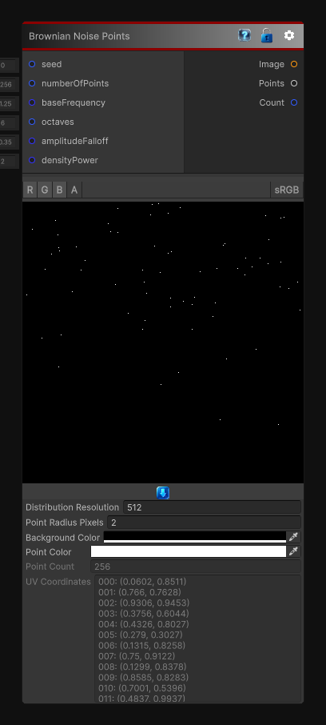

# Brownian Noise Points

> This file is auto-generated by `Documentation/Generate-GenesisNodeDocs.ps1`.

[Back to index](../../README.md) | [Back to Generators](../../generators.md)

## Snapshot

## Details

- Menu: `Generators/Points/Brownian Noise Points`
- Node group: `Noise`
- Source: [Runtime/Nodes/Generator/Noise/PointGenerator/BrownianNoisePointsNode.cs](../../../../Runtime/Nodes/Generator/Noise/PointGenerator/BrownianNoisePointsNode.cs)

## Documentation

Generates random 2D points from an internally generated Brownian-noise density field.

Brownian noise strongly favors lower frequencies, so the resulting points gather into broad, smooth clusters with less fine detail than the pink-noise point generator. The `Points` output contains normalized UV coordinates in the `[0, 1]` range.
