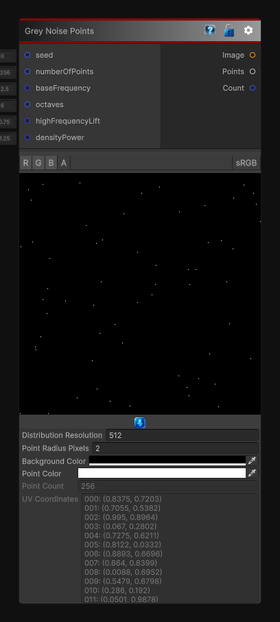

# Grey Noise Points

> This file is auto-generated by `Documentation/Generate-GenesisNodeDocs.ps1`.

[Back to index](../../README.md) | [Back to Generators](../../generators.md)

## Snapshot

## Details

- Menu: `Generators/Points/Grey Noise Points`
- Node group: `Noise`
- Source: [Runtime/Nodes/Generator/Noise/PointGenerator/GreyNoisePointsNode.cs](../../../../Runtime/Nodes/Generator/Noise/PointGenerator/GreyNoisePointsNode.cs)

## Documentation

Generates random 2D points from an internally generated grey-noise density field.

Grey noise uses a more balanced, equalized spread of octaves than pink or Brownian noise, so no single frequency band dominates the point placement. The `Points` output contains normalized UV coordinates in the `[0, 1]` range.
