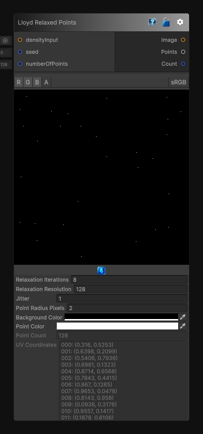

# Lloyd Relaxed Points

> This file is auto-generated by `Documentation/Generate-GenesisNodeDocs.ps1`.

[Back to index](../../README.md) | [Back to Generators](../../generators.md)

## Snapshot

## Details

- Menu: `Generators/Points/Lloyd Relaxed Points`
- Node group: `Noise`
- Source: [Runtime/Nodes/Generator/Noise/PointGenerator/LloydRelaxedPointsNode.cs](../../../Doxygen/html/_lloyd_relaxed_points_node_8cs_source.html)

## Documentation

Generates a Lloyd-relaxed point distribution and outputs both the preview image and normalized UV coordinates.

This node starts from a jittered distribution, then repeatedly computes Voronoi-style nearest-cell ownership and moves each point toward its centroid. When a density texture is connected, the relaxation becomes density-weighted so brighter regions attract more points.
