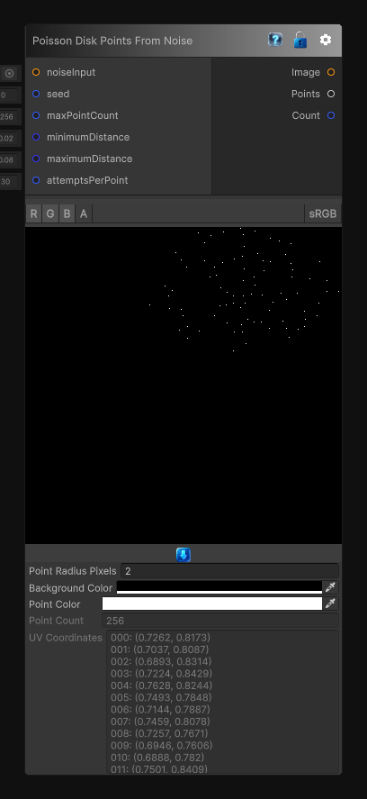

# Poisson Disk Points From Noise

> This file is auto-generated by `Documentation/Generate-GenesisNodeDocs.ps1`.

[Back to index](../../README.md) | [Back to Generators](../../generators.md)

## Snapshot

## Details

- Menu: `Generators/Points/Poisson Disk Points From Noise`
- Node group: `Noise`
- Source: [Runtime/Nodes/Generator/Noise/NoiseScaledPoissonDiskPointsNode.cs](../../../Doxygen/html/_noise_scaled_poisson_disk_points_node_8cs_source.html)

## Documentation

Generates adaptive Poisson disk points using a noise texture to scale the local disk size.

Darker areas use the smaller disk size and produce denser point placement, while brighter areas use the larger disk size and push points farther apart. The `Points` output contains normalized UV coordinates in the `[0, 1]` range.
