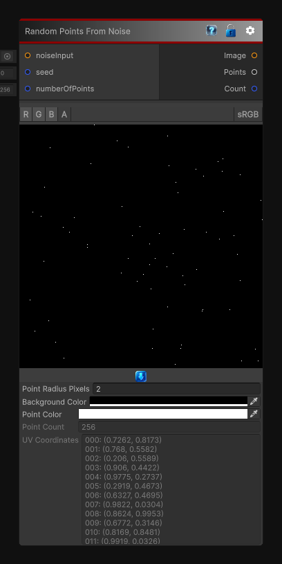

# Random Points From Noise

> This file is auto-generated by `Documentation/Generate-GenesisNodeDocs.ps1`.

[Back to index](../../README.md) | [Back to Generators](../../generators.md)

## Snapshot

## Details

- Menu: `Generators/Points/Random Points From Noise`
- Node group: `Noise`
- Source: [Runtime/Nodes/Generator/Noise/NoiseWeightedRandomPointsNode.cs](../../../../Runtime/Nodes/Generator/Noise/NoiseWeightedRandomPointsNode.cs)

## Documentation

Generates random 2D points using a noise texture as a probability map, so brighter areas are sampled more often than darker ones.

If no noise input is connected, the node falls back to uniform random sampling. The `Points` output contains normalized UV coordinates in the `[0, 1]` range.
