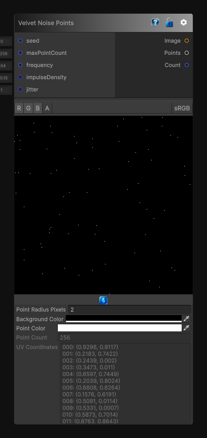

# Velvet Noise Points

> This file is auto-generated by `Documentation/Generate-GenesisNodeDocs.ps1`.

[Back to index](../../README.md) | [Back to Generators](../../generators.md)

## Snapshot

## Details

- Menu: `Generators/Points/Velvet Noise Points`
- Node group: `Noise`
- Source: [Runtime/Nodes/Generator/Noise/PointGenerator/VelvetNoisePointsNode.cs](../../../Doxygen/html/_velvet_noise_points_node_8cs_source.html)

## Documentation

Generates 2D points from an internally generated velvet-noise impulse field.

Velvet noise is a sparse field of random impulses, so this node emits jittered points from randomly activated grid cells. The `Points` output contains normalized UV coordinates in the `[0, 1]` range.
