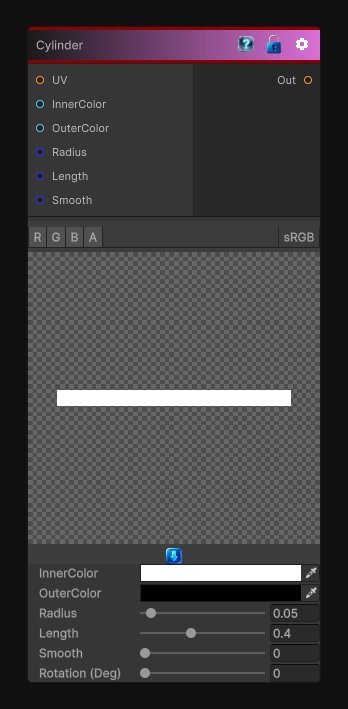

# Cylinder

> This file is auto-generated by `Documentation/Generate-GenesisNodeDocs.ps1`.

[Back to index](../../README.md) | [Back to Generators](../../generators.md)

## Snapshot

## Details

- Menu: `Generators/Shapes/Cylinder`
- Node group: `Shape`
- Shader: `Hidden/Genesis/Cylinder`
- Source: [Runtime/Nodes/Generator/Shape/CylindersNode.cs](../../../Doxygen/html/_cylinders_node_8cs_source.html)

## Documentation

Generates a line pattern. In 3D this node generate cylinders using a signed distance field function.
