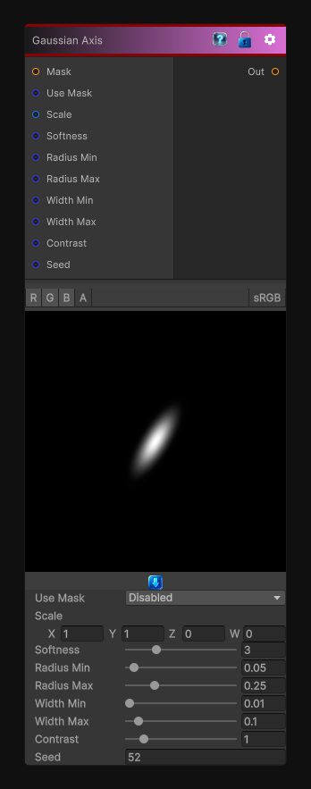

# Gaussian Axis

> This file is auto-generated by `Documentation/Generate-GenesisNodeDocs.ps1`.

[Back to index](../../README.md) | [Back to Generators](../../generators.md)

## Snapshot

## Details

- Menu: `Generators/Shapes/Gaussian Axis`
- Node group: `Shape`
- Shader: `Hidden/Genesis/GaussianAxial`
- Source: [Runtime/Nodes/Generator/Shape/GaussianAxialNode.cs](../../../Doxygen/html/_gaussian_axial_node_8cs_source.html)

## Documentation

- 	A 1D Gaussian stretched along an axis
- 	With optional per-cell random rotation
- 	Perfect for fibers, streaks, directional breakup, anisotropic grunge
