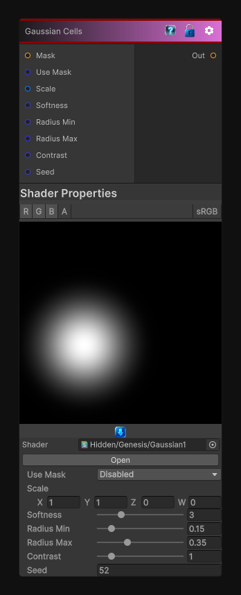

# Gaussian Cells

> This file is auto-generated by `Documentation/Generate-GenesisNodeDocs.ps1`.

[Back to index](../../README.md) | [Back to Generators](../../generators.md)

## Snapshot

## Details

- Menu: `Generators/Shapes/Gaussian Cells`
- Node group: `Shape`
- Shader: `Hidden/Genesis/Gaussian1`
- Source: [Runtime/Nodes/Generator/Shape/GaussianNode.cs](../../../../Runtime/Nodes/Generator/Shape/GaussianNode.cs)

## Documentation

- A single soft Gaussian blob per cell
- Deterministic, sampler-free
- Fully procedural
- Perfect as a building block for grunge, masks, breakup, height maps
