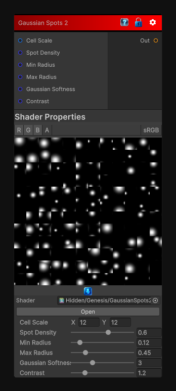

# Gaussian Spots 2

> This file is auto-generated by `Documentation/Generate-GenesisNodeDocs.ps1`.

[Back to index](../../README.md) | [Back to Generators](../../generators.md)

## Snapshot

## Details

- Menu: `Generators/Shapes/Gaussian Spots 2`
- Node group: `Shapes`
- Shader: `Hidden/Genesis/GaussianSpots2`
- Source: [Runtime/Nodes/Generator/Shape/GaussianSpotsNode2.cs](../../../../Runtime/Nodes/Generator/Shape/GaussianSpotsNode2.cs)

## Documentation

- Larger, softer Gaussian blobs
- Smooth watercolor halos
- Gentle warp for organic diffusion
- More painterly gradients
- Less "grainy," more "cloud-like"
- Perfect for stylized masks, roughness breakup, watercolor textures
