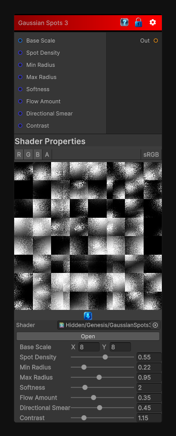

# Gaussian Spots 3

> This file is auto-generated by `Documentation/Generate-GenesisNodeDocs.ps1`.

[Back to index](../../README.md) | [Back to Generators](../../generators.md)

## Snapshot

## Details

- Menu: `Generators/Shapes/Gaussian Spots 3`
- Node group: `Shapes`
- Shader: `Hidden/Genesis/GaussianSpots3`
- Source: [Runtime/Nodes/Generator/Shape/GaussianSpotsNode3.cs](../../../../Runtime/Nodes/Generator/Shape/GaussianSpotsNode3.cs)

## Documentation

- Large, soft, drifting blobs
- Directional smear (anisotropic stretch)
- Watercolor-like diffusion
- Soft turbulence
- Painterly gradients
- Less "dots," more "organic patches"
