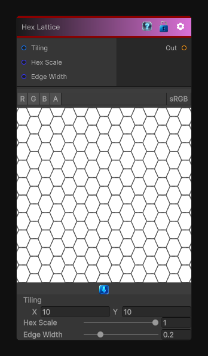

# Hex Lattice

> This file is auto-generated by `Documentation/Generate-GenesisNodeDocs.ps1`.

[Back to index](../../README.md) | [Back to Generators](../../generators.md)

## Snapshot

## Details

- Menu: `Generators/Shapes/Hex Lattice`
- Node group: `Shape`
- Shader: `Hidden/Genesis/HexLattice`
- Source: [Runtime/Nodes/Generator/Shape/HexLatticeNode.cs](../../../Doxygen/html/_hex_lattice_node_8cs_source.html)

## Documentation

Generates a hexagonal lattice pattern
