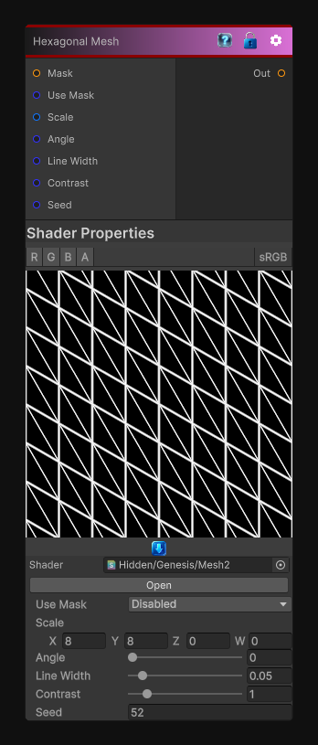

# Hexagonal Mesh

> This file is auto-generated by `Documentation/Generate-GenesisNodeDocs.ps1`.

[Back to index](../../README.md) | [Back to Generators](../../generators.md)

## Snapshot

## Details

- Menu: `Generators/Shapes/Hexagonal Mesh`
- Node group: `Shape`
- Shader: `Hidden/Genesis/Mesh2`
- Source: [Runtime/Nodes/Generator/Shape/HexagonalMeshNode.cs](../../../../Runtime/Nodes/Generator/Shape/HexagonalMeshNode.cs)

## Documentation

- A clean hexagonal mesh (regular hex tiling)
- Adjustable scale, rotation, line width, contrast
- Perfect for:
- sci-fi panels
- stylized surfaces
- architectural patterns
- curvature-driven effects
- procedural masks
- Deterministic, CRT-safe, sampler-free except optional mask
