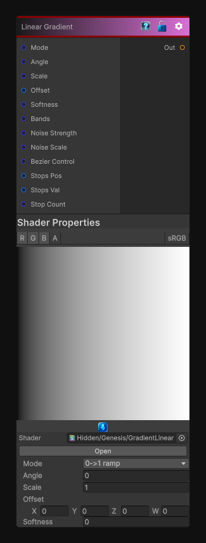

# Linear Gradient

> This file is auto-generated by `Documentation/Generate-GenesisNodeDocs.ps1`.

[Back to index](../../README.md) | [Back to Generators](../../generators.md)

## Snapshot

## Details

- Menu: `Generators/Shapes/Linear Gradient`
- Node group: `Shape`
- Shader: `Hidden/Genesis/GradientLinear`
- Source: [Runtime/Nodes/Generator/Shape/LinearGradientNode.cs](../../../../Runtime/Nodes/Generator/Shape/LinearGradientNode.cs)

## Documentation

A full function gradient generator that supports the following modes:
0	Linear 1 (0->1 ramp)
1	Linear 2 (triangle)
2	Linear 3 (smooth mirrored cosine)
3	Radial
4	Circular (distance from center)
5	Angular (polar angle)
6	Diamond
7	Bilinear
8	Quad (2D paraboloid)
9	Bezier (2-point curve)
10	Multi-stop (up to 8 stops)
11	Gradient Bands
12	Gradient Noise Modulation
