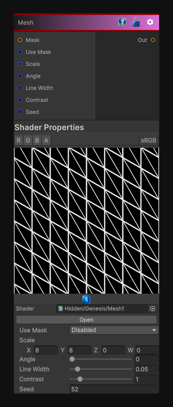

# Mesh

> This file is auto-generated by `Documentation/Generate-GenesisNodeDocs.ps1`.

[Back to index](../../README.md) | [Back to Generators](../../generators.md)

## Snapshot

## Details

- Menu: `Generators/Shapes/Mesh`
- Node group: `Shape`
- Shader: `Hidden/Genesis/Mesh1`
- Source: [Runtime/Nodes/Generator/Shape/Mesh1Node.cs](../../../../Runtime/Nodes/Generator/Shape/Mesh1Node.cs)

## Documentation

generates:
- A triangular mesh (equilateral tiling)
- With barycentric distance shading
- Adjustable line width, contrast, scale, and rotation
- Optional mask
- Perfect for height maps, normals, curvature, and stylized patterns
