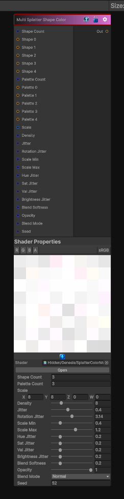

# Multi Splatter Shape Color

> This file is auto-generated by `Documentation/Generate-GenesisNodeDocs.ps1`.

[Back to index](../../README.md) | [Back to Generators](../../generators.md)

## Snapshot

## Details

- Menu: `Generators/Shapes/Multi Splatter Shape Color`
- Node group: `Shape`
- Shader: `Hidden/Genesis/SplatterColorMultiPaletteMultiShape`
- Source: [Runtime/Nodes/Generator/Shape/MultiSplatterShapeColorNode.cs](../../../../Runtime/Nodes/Generator/Shape/MultiSplatterShapeColorNode.cs)

## Documentation

This node supports:
- Multiple shapes
- Each instance randomly picks from N shapes
- Independent UV transforms per shape
- Independent rotation/scale jitter per shape
- Multiple palettes
- Each instance randomly picks from N palettes
- Each palette can be a strip or a full 2D color map
- Per-palette hue/sat/value jitter
- Full per-instance randomness
- Position
- Rotation
- Scale
- Color
- Opacity
- Blend mode
