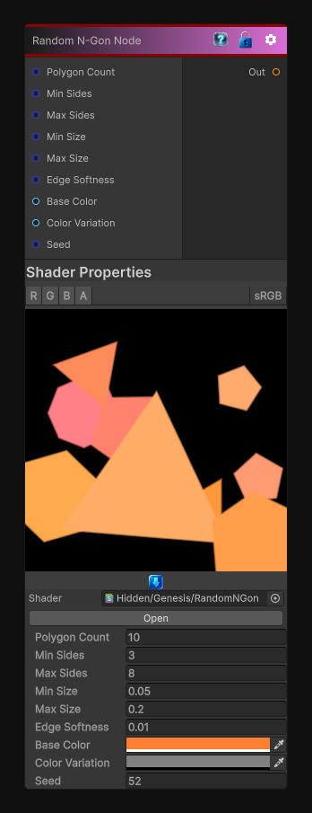

# Random N-Gon Node

> This file is auto-generated by `Documentation/Generate-GenesisNodeDocs.ps1`.

[Back to index](../../README.md) | [Back to Generators](../../generators.md)

## Snapshot

## Details

- Menu: `Generators/Shapes/Random N-Gon`
- Node group: `Shape`
- Shader: `Hidden/Genesis/RandomNGon`
- Source: [Runtime/Nodes/Generator/Shape/RandomNGonNode.cs](../../../../Runtime/Nodes/Generator/Shape/RandomNGonNode.cs)

## Documentation

Generates a random N-sided polygon.
