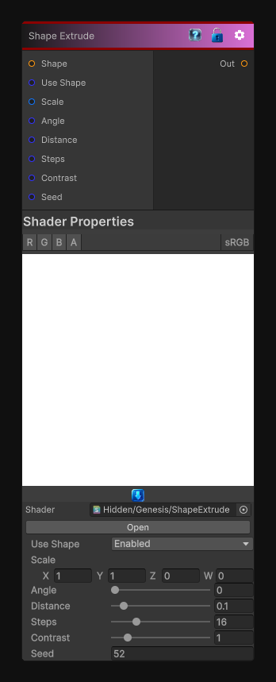

# Shape Extrude

> This file is auto-generated by `Documentation/Generate-GenesisNodeDocs.ps1`.

[Back to index](../../README.md) | [Back to Generators](../../generators.md)

## Snapshot

## Details

- Menu: `Generators/Shapes/Shape Extrude`
- Node group: `Shape`
- Shader: `Hidden/Genesis/ShapeExtrude`
- Source: [Runtime/Nodes/Generator/Shape/ShapeExtrudeNode.cs](../../../../Runtime/Nodes/Generator/Shape/ShapeExtrudeNode.cs)

## Documentation

Think of it as the shape-domain sibling of Height Extrude:
- Instead of extruding a heightmap, you extrude a binary or grayscale shape
- It expands the silhouette outward along a direction
- Produces clean, controllable shape inflation
- Perfect for bevels, outlines, directional offsets, stylized silhouettes, and mask growt
