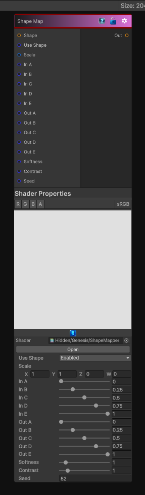

# Shape Map

> This file is auto-generated by `Documentation/Generate-GenesisNodeDocs.ps1`.

[Back to index](../../README.md) | [Back to Generators](../../generators.md)

## Snapshot

## Details

- Menu: `Generators/Shapes/Shape Map`
- Node group: `Shape`
- Shader: `Hidden/Genesis/ShapeMapper`
- Source: [Runtime/Nodes/Generator/Shape/ShapeMapperNode.cs](../../../../Runtime/Nodes/Generator/Shape/ShapeMapperNode.cs)

## Documentation

In Genesis, Shape Map is used to:
- turn circles into capsules
- turn squares into rounded squares
- turn gradients into stepped shapes
- remap silhouettes
- build stylized shapes from simple primitives
- create procedural icons, UI shapes, bevel profiles, etc
