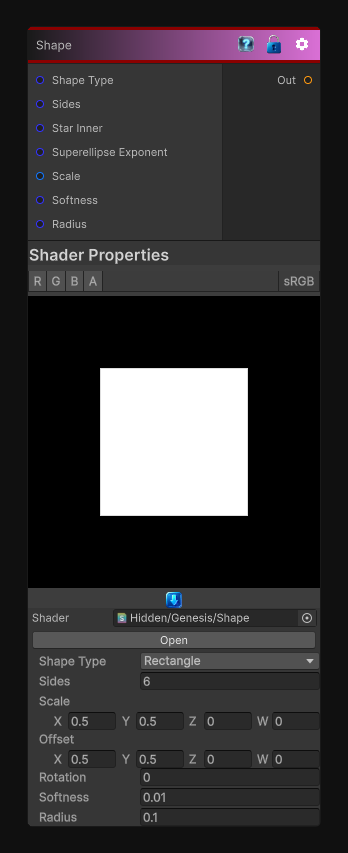

# Shape

> This file is auto-generated by `Documentation/Generate-GenesisNodeDocs.ps1`.

[Back to index](../../README.md) | [Back to Generators](../../generators.md)

## Snapshot

## Details

- Menu: `Generators/Shapes/Shape`
- Node group: `Shape`
- Shader: `Hidden/Genesis/Shape`
- Source: [Runtime/Nodes/Generator/Shape/ShapeNode.cs](../../../../Runtime/Nodes/Generator/Shape/ShapeNode.cs)

## Documentation

- Rectangle
- Ellipse
- Polygon (N-gon)
- Rounded Rectangle
- Softness
- Rotation
- Scale & Offset
- Deterministic, sampler-free
