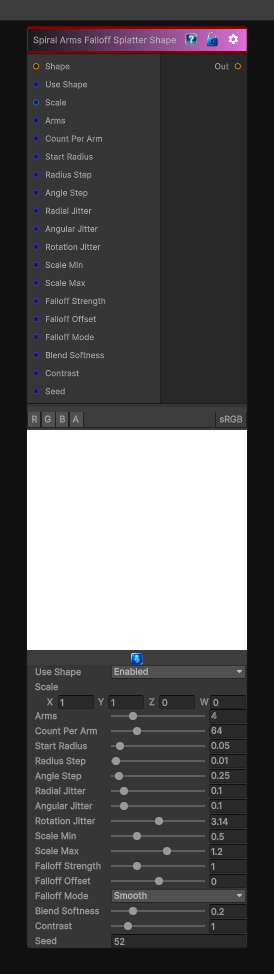

# Spiral Arms Falloff Splatter Shape

> This file is auto-generated by `Documentation/Generate-GenesisNodeDocs.ps1`.

[Back to index](../../README.md) | [Back to Generators](../../generators.md)

## Snapshot

## Details

- Menu: `Generators/Shapes/Spiral Arms Falloff Splatter Shape`
- Node group: `Shape`
- Shader: `Hidden/Genesis/ShapeSplatterCircularSpiralArmsFalloff`
- Source: [Runtime/Nodes/Generator/Shape/SpiralArmsFalloffShapeSplatterNode.cs](../../../Doxygen/html/_spiral_arms_falloff_shape_splatter_node_8cs_source.html)

## Documentation

This variant keeps everything from Spiral Per-Arm Variation, but adds:
- Per-instance falloff (fade along each arm)
- Multiple falloff modes (linear, smoothstep, exponential)
- Optional per-arm falloff offset
- Optional per-arm falloff strengt
