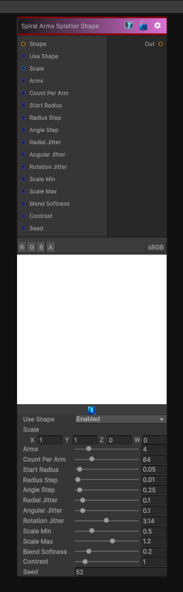

# Spiral Arms Splatter Shape

> This file is auto-generated by `Documentation/Generate-GenesisNodeDocs.ps1`.

[Back to index](../../README.md) | [Back to Generators](../../generators.md)

## Snapshot

## Details

- Menu: `Generators/Shapes/Spiral Arms Splatter Shape`
- Node group: `Shape`
- Shader: `Hidden/Genesis/ShapeSplatterCircularSpiralArms`
- Source: [Runtime/Nodes/Generator/Shape/SpiralArmsShapeSplatterNode.cs](../../../Doxygen/html/_spiral_arms_shape_splatter_node_8cs_source.html)

## Documentation

Instead of a single spiral, this variant gives you multiple spiral arms, each with its own:
- Angle offset
- Radius growth
- Angle step
- Jitter
- Scale variation
- Rotation variation
