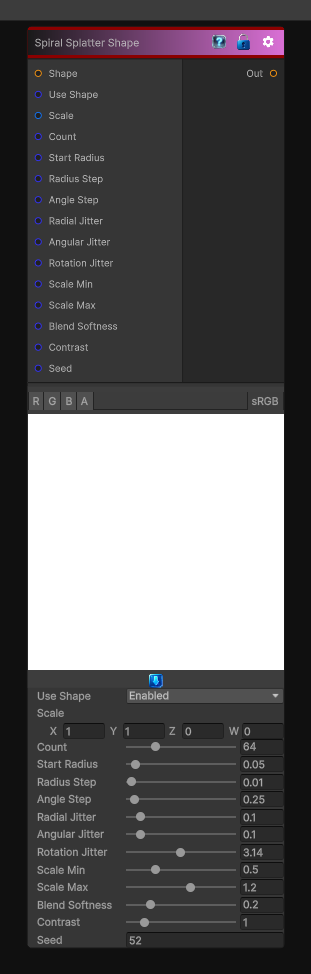

# Spiral Splatter Shape

> This file is auto-generated by `Documentation/Generate-GenesisNodeDocs.ps1`.

[Back to index](../../README.md) | [Back to Generators](../../generators.md)

## Snapshot

## Details

- Menu: `Generators/Shapes/Spiral Splatter Shape`
- Node group: `Shape`
- Shader: `Hidden/Genesis/ShapeSplatterCircularSpiral`
- Source: [Runtime/Nodes/Generator/Shape/SpiralShapeSplatterNode.cs](../../../Doxygen/html/_spiral_shape_splatter_node_8cs_source.html)

## Documentation

This node scatters shape instances around a spiral path, giving you:
- Spiral arms
- Angular progression
- Radial growth
- Per-instance rotation, scale, jitter
- Fully deterministic, sampler-free except for the shape inpu
