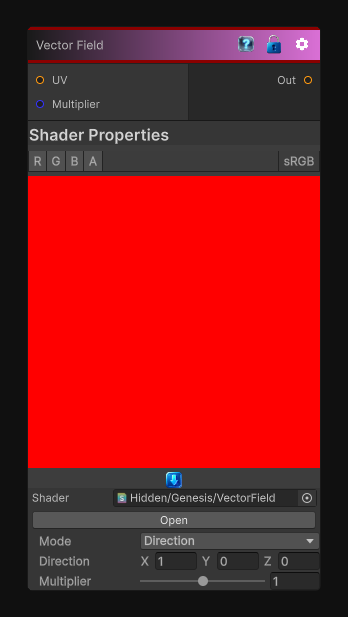

# Vector Field

> This file is auto-generated by `Documentation/Generate-GenesisNodeDocs.ps1`.

[Back to index](../../README.md) | [Back to Generators](../../generators.md)

## Snapshot

## Details

- Menu: `Generators/Shapes/Vector Field`
- Node group: `Shape`
- Shader: `Hidden/Genesis/VectorField`
- Source: [Runtime/Nodes/Generator/Shape/VectorFieldNode.cs](../../../../Runtime/Nodes/Generator/Shape/VectorFieldNode.cs)

## Documentation

Generates a vector field using presets to achieve different patterns. The mode property is used to control the pattern to use for the vector field.
Currently these patterns are implemented:
- Direction: generates an uniform vector field with a direction
- Circular: generates a vector field rotating around the middle of the texture
- Stripes: generates alternated stripes of direction vectors
- Turbulence: perlin noise based turbulence vector field.
