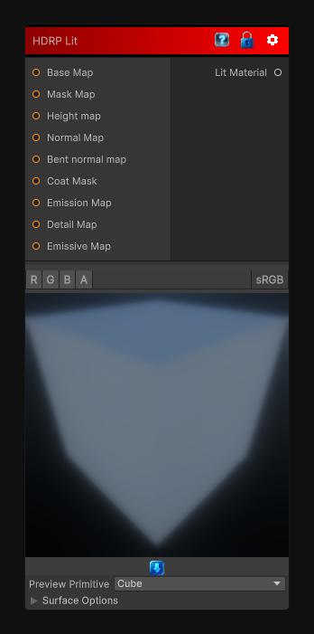

# HDRP Lit

> This file is auto-generated by `Documentation/Generate-GenesisNodeDocs.ps1`.

[Back to index](../../README.md) | [Back to Material](../../material.md)

## Snapshot

## Details

- Menu: `Material/HDRP/HDRP Lit`
- Node group: `Material`
- Source: [Runtime/Nodes/Material/HDRP/HDRPLitMaterial.cs](../../../Doxygen/html/_h_d_r_p_lit_material_8cs_source.html)

## Documentation

Output a Lit HDRP Material
