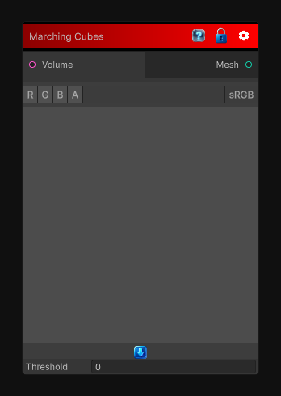

# Marching Cubes

> This file is auto-generated by `Documentation/Generate-GenesisNodeDocs.ps1`.

[Back to index](../../README.md) | [Back to Mesh](../../mesh.md)

## Snapshot

## Details

- Menu: `Mesh/IsoSurface (Marching Cubes)`
- Source: [Runtime/Nodes/Mesh/IsoSurfaceNode.cs](../../../Doxygen/html/_iso_surface_node_8cs_source.html)

## Documentation

Transform a 3D texture into a volume using an iso surface algorithm (Marching cubes currently).
