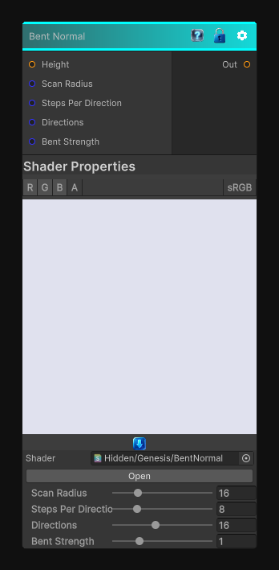

# Bent Normal

> This file is auto-generated by `Documentation/Generate-GenesisNodeDocs.ps1`.

[Back to index](../../README.md) | [Back to Normal](../../normal.md)

## Snapshot

## Details

- Menu: `Normal/Bent Normal`
- Node group: `Normal`
- Shader: `Hidden/Genesis/BentNormal`
- Source: [Runtime/Nodes/Normals/BentNormalNode.cs](../../../../Runtime/Nodes/Normals/BentNormalNode.cs)

## Documentation

A bent normal is essentially:
- A normal vector bent away from occlusion
- Computed from a height map
- Using multi-directional horizon scanning
- Producing a "best visible direction" normal
It's like a hybrid between:
- Ambient occlusion
- Curvature
- A visibility-weighted normal
And it's incredibly useful for:
- Stylized shading
- Edge wear
- Directional AO
- Smart masks
- Height-aware blending
