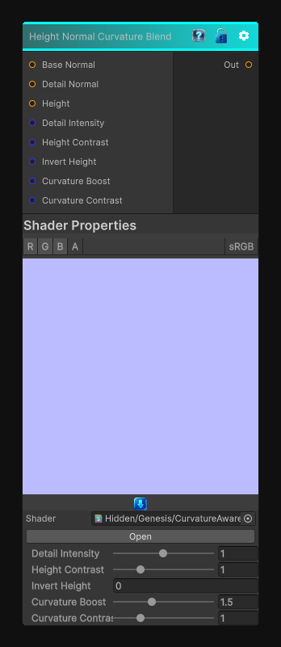

# Height Normal Curvature Blend

> This file is auto-generated by `Documentation/Generate-GenesisNodeDocs.ps1`.

[Back to index](../../README.md) | [Back to Normal](../../normal.md)

## Snapshot

## Details

- Menu: `Normal/Height Normal Curvature Blend`
- Node group: `Normal`
- Shader: `Hidden/Genesis/CurvatureAwareHeightNormalBlender`
- Source: [Runtime/Nodes/Normals/HeightNormalCurvatureBlenderNode.cs](../../../../Runtime/Nodes/Normals/HeightNormalCurvatureBlenderNode.cs)

## Documentation

- Take base normal, detail normal, and height
- Compute curvature from the height map (Sobel -> magnitude -> shaping)
- Use curvature to boost detail normal intensity in high-curvature regions
- Still respect the height-driven blend mask
- Still use proper tangent-space normal blending
- Fully deterministic, CRT-safe, no derivatives
This gives you:
- Sharper detail on edges
- Softer detail in flat regions
- Height-aware detail placement
- A more physically-plausible blend
