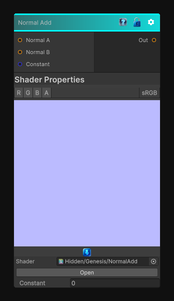

# Normal Add

> This file is auto-generated by `Documentation/Generate-GenesisNodeDocs.ps1`.

[Back to index](../../README.md) | [Back to Normal](../../normal.md)

## Snapshot

## Details

- Menu: `Normal/Normal Add`
- Node group: `Normal`
- Shader: `Hidden/Genesis/NormalAdd`
- Source: [Runtime/Nodes/Normals/NormalAddNode.cs](../../../../Runtime/Nodes/Normals/NormalAddNode.cs)

## Documentation

Add two normal maps using the surface gradient functions.
