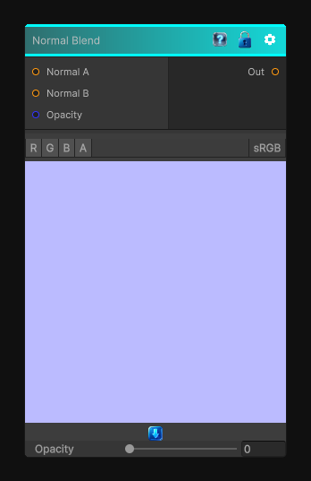

# Normal Blend

> This file is auto-generated by `Documentation/Generate-GenesisNodeDocs.ps1`.

[Back to index](../../README.md) | [Back to Normal](../../normal.md)

## Snapshot

## Details

- Menu: `Normal/Normal Blend`
- Node group: `Normal`
- Shader: `Hidden/Genesis/NormalBlend`
- Source: [Runtime/Nodes/Normals/NormalBlendNode.cs](../../../Doxygen/html/_normal_blend_node_8cs_source.html)

## Documentation

Blends two normals
