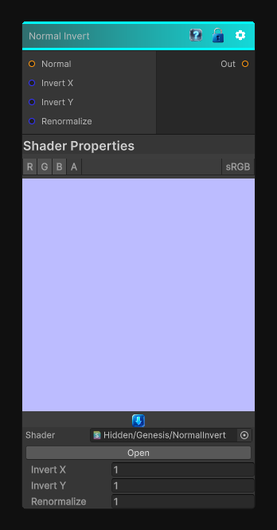

# Normal Invert

> This file is auto-generated by `Documentation/Generate-GenesisNodeDocs.ps1`.

[Back to index](../../README.md) | [Back to Normal](../../normal.md)

## Snapshot

## Details

- Menu: `Normal/Normal Invert`
- Node group: `Normal`
- Shader: `Hidden/Genesis/NormalInvert`
- Source: [Runtime/Nodes/Normals/NormalInvertNode.cs](../../../../Runtime/Nodes/Normals/NormalInvertNode.cs)

## Documentation

- Takes a tangent-space normal map
- Converts from 0-1 -> -1..1
- Flips the X and Y channels (Z stays the same)
- Re-normalizes
- Outputs back in 0-1 space
