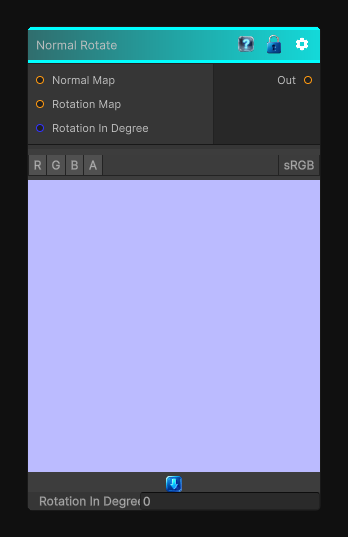

# Normal Rotate

> This file is auto-generated by `Documentation/Generate-GenesisNodeDocs.ps1`.

[Back to index](../../README.md) | [Back to Normal](../../normal.md)

## Snapshot

## Details

- Menu: `Normal/Normal Rotate`
- Node group: `Normal`
- Shader: `Hidden/Genesis/NormalRotate`
- Source: [Runtime/Nodes/Normals/NormalRotateNode.cs](../../../Doxygen/html/_normal_rotate_node_8cs_source.html)

## Documentation

Rotate the normal map vector with a certain angle in degree.
