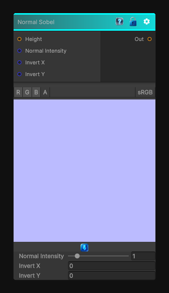

# Normal Sobel

> This file is auto-generated by `Documentation/Generate-GenesisNodeDocs.ps1`.

[Back to index](../../README.md) | [Back to Normal](../../normal.md)

## Snapshot

## Details

- Menu: `Normal/Normal Sobel`
- Node group: `Normal`
- Shader: `Hidden/Genesis/NormalSobel`
- Source: [Runtime/Nodes/Normals/NormalSobelNode.cs](../../../Doxygen/html/_normal_sobel_node_8cs_source.html)

## Documentation

it converts a height map into a tangent-space normal map using Sobel gradients.
- Sobel X/Y gradient from height
- Adjustable intensity
- Proper tangent-space normal reconstruction
- Deterministic, CRT-safe sampling
- No derivatives, no mip bias, no nondeterminism
