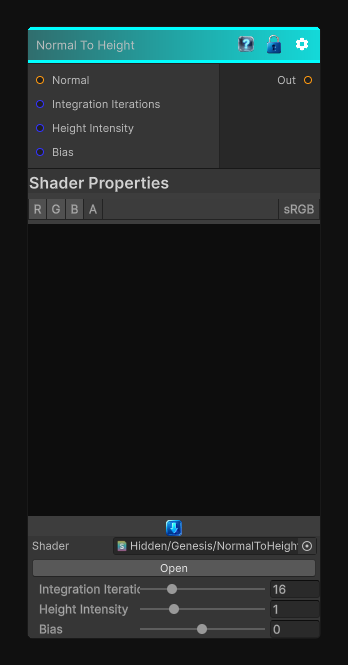

# Normal To Height

> This file is auto-generated by `Documentation/Generate-GenesisNodeDocs.ps1`.

[Back to index](../../README.md) | [Back to Normal](../../normal.md)

## Snapshot

## Details

- Menu: `Normal/Normal To Height`
- Node group: `Normal`
- Shader: `Hidden/Genesis/NormalToHeight`
- Source: [Runtime/Nodes/Normals/NormalToHeightNode.cs](../../../../Runtime/Nodes/Normals/NormalToHeightNode.cs)

## Documentation

A normal map encodes:
N=(n_x,n_y,n_z)
Where n_x and n_y are proportional to the slope of the height field:
\frac{\partial h}{\partial x}=-\frac{n_x}{n_z},\quad \frac{\partial h}{\partial y}=-\frac{n_y}{n_z}
So to reconstruct height, we need to:
- Convert normal to slope
- Integrate slope across the image
- Use iterative accumulation (CRT-safe)
- Provide intensity + bias controls
- Keep everything deterministic
