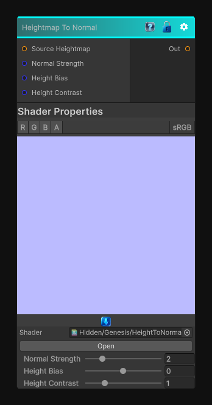

# Heightmap To Normal

> This file is auto-generated by `Documentation/Generate-GenesisNodeDocs.ps1`.

[Back to index](../../README.md) | [Back to Normal](../../normal.md)

## Snapshot

## Details

- Menu: `Normal/To Normal`
- Node group: `Normal`
- Shader: `Hidden/Genesis/HeightToNormal`
- Source: [Runtime/Nodes/Normals/ToNormalNode.cs](../../../../Runtime/Nodes/Normals/ToNormalNode.cs)

## Documentation

Takes an input texture and converts it to a normal.  Usually used on a height map
