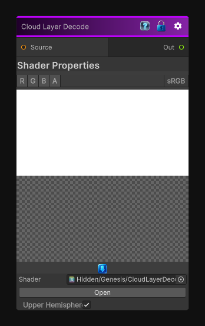

# Cloud Layer Decode

> This file is auto-generated by `Documentation/Generate-GenesisNodeDocs.ps1`.

[Back to index](../../README.md) | [Back to Operations](../../operations.md)

## Snapshot

## Details

- Menu: `Operations/Cloud Layer Decode`
- Node group: `Operations`
- Shader: `Hidden/Genesis/CloudLayerDecode`
- Source: [Runtime/Nodes/Operations/CloudLayerDecodeNode.cs](../../../../Runtime/Nodes/Operations/CloudLayerDecodeNode.cs)

## Documentation

Decodes a 2D texture into a cubemap, the input texture has to be formated for the HDRP cloud layer system (latlong).
