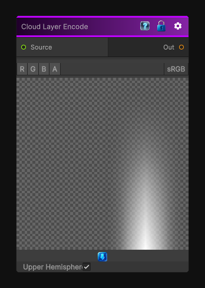

# Cloud Layer Encode

> This file is auto-generated by `Documentation/Generate-GenesisNodeDocs.ps1`.

[Back to index](../../README.md) | [Back to Operations](../../operations.md)

## Snapshot

## Details

- Menu: `Operations/Cloud Layer Encode`
- Node group: `Operations`
- Shader: `Hidden/Genesis/CloudLayerEncode`
- Source: [Runtime/Nodes/Operations/CloudLayerEncode.cs](../../../Doxygen/html/_cloud_layer_encode_8cs_source.html)

## Documentation

Encodes a Cubemap texture into a 2D map, the output texture is formated for the HDRP cloud layer system (latlong).
