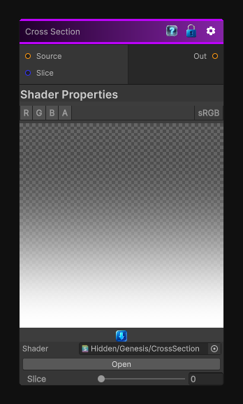

# Cross Section

> This file is auto-generated by `Documentation/Generate-GenesisNodeDocs.ps1`.

[Back to index](../../README.md) | [Back to Operations](../../operations.md)

## Snapshot

## Details

- Menu: `Operations/Cross Section`
- Node group: `Operations`
- Shader: `Hidden/Genesis/CrossSection`
- Source: [Runtime/Nodes/Operations/CrossSectionNode.cs](../../../../Runtime/Nodes/Operations/CrossSectionNode.cs)

## Documentation

The cross section node allow you to generate 2D texture by taking either a slice of a texture 2D or 3D.
Right now this node is limited to slices on the Y axis.
